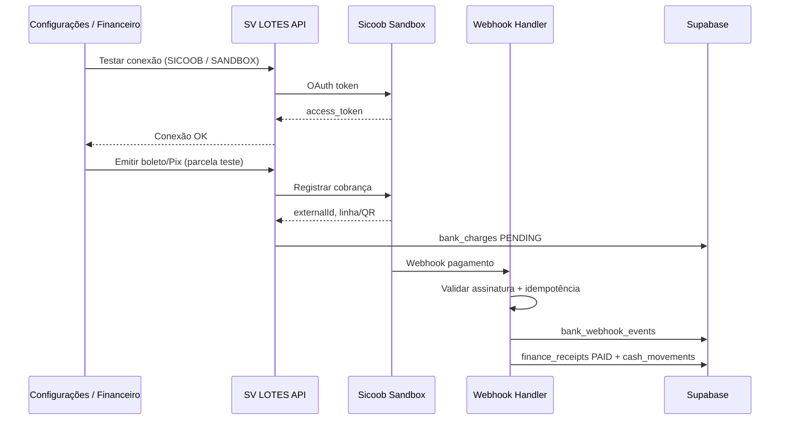

# Fase 2.1 — Homologação real Sicoob

Checklist técnico e estrutura segura para homologação do conector **Sicoob** no SV LOTES 2.0.

> **Pré-requisito concluído:** [Fase 2.0 — Provider Sicoob estrutural](#fase-20--provider-sicoob-estrutural) (develop).

| Item | Valor |
|------|-------|
| **Branch** | `develop` apenas |
| **Produção (`main`)** | Não alterar nesta fase |
| **Emissão real** | Proibida nesta fase |
| **Referência** | [SVLOTES_2_BANKING_MODULE.md](./SVLOTES_2_BANKING_MODULE.md) |
| **Provider alvo** | `SICOOB` (COMPE 756) |
| **Ambiente desta fase** | Sandbox / homologação exclusivamente |

---

## Fase 2.0 — Provider Sicoob estrutural

**Status:** implementado em `develop` · **Sem API real**

| Entrega | Caminho |
|---------|---------|
| Provider Sicoob | `lib/banking/providers/sicoobBankProvider.ts` |
| Validação de config | `lib/banking/sicoobConfigValidation.ts` |
| Handler test connection | `lib/banking/sicoobApiHandlers.ts` |
| Rota test connection | `app/api/banking/sicoob/test-connection/route.ts` |
| Registry | `lib/banking/registry.ts` → `SICOOB` + `MOCK` |

Comportamento Fase 2.0:

- `testConnection()` — valida campos obrigatórios localmente
- `createBoleto()` — erro: *"Sicoob boleto real ainda não habilitado nesta fase."*
- `createPix()` — erro: *"Sicoob Pix real ainda não habilitado nesta fase."*
- Demais métodos — erro controlado de não implementado
- UI — aviso Sicoob; botões MOCK ocultos quando banco ≠ MOCK

---

## Escopo da Fase 2.1

Esta fase **planeja e valida** a integração Sicoob em ambiente de homologação. Não inclui:

- Deploy ou merge em `main`
- Emissão de cobrança em produção
- Conexão com banco real fora do sandbox acordado com o cliente
- Alteração de fluxos financeiros já aprovados em produção

Inclui:

- Checklist de dados e permissões a solicitar ao cliente/banco
- Fluxo técnico de homologação passo a passo
- Regras de segurança obrigatórias
- Critérios objetivos para avançar à produção controlada (Fase 2.2+)

---

## 1. Dados a solicitar ao cliente / banco

Preencher com o cliente e confirmar por escrito com o gerente/cooperativa Sicoob antes de iniciar testes.

### 1.1 Credenciais OAuth / API

| Campo | Obrigatório | Onde armazenar no SV LOTES | Observação |
|-------|-------------|----------------------------|------------|
| **Client ID** | Sim | `bank_integrations.client_id` | Identificador da aplicação no portal Sicoob |
| **Client Secret** | Sim | `bank_credentials` (criptografado) | Nunca retornar em API/UI após gravação |
| **Certificado A1** (.pfx / .p12) | Se exigido pelo Sicoob | Storage privado + referência em `certificate_name` | Confirmar com o banco se mTLS é obrigatório |
| **Senha do certificado** | Se certificado A1 | `bank_credentials` (criptografado) | Nunca logar nem expor em resposta HTTP |

### 1.2 Dados da conta cooperativa

| Campo | Obrigatório | Campo SV LOTES | Observação |
|-------|-------------|----------------|------------|
| **Agência** | Sim | `agency` | Sem dígito, salvo orientação contrária |
| **Conta** | Sim | `account` | Conta corrente de recebimento |
| **Dígito** | Sim | `accountDigit` | Dígito verificador |
| **Convênio** | Sim (boleto) | `agreementCode` | Código do convênio de cobrança |
| **Carteira** | Sim (boleto) | `walletCode` | Carteira de cobrança registrada |
| **Código do beneficiário** | Sim (boleto) | `beneficiaryCode` | Conforme manual Sicoob |
| **Chave Pix** | Sim (Pix) | `pixKey` | CNPJ, e-mail, telefone ou EVP — confirmar tipo |

### 1.3 Ambiente e endpoints

| Item | Obrigatório | Campo SV LOTES | Observação |
|------|-------------|----------------|------------|
| **Ambiente** | Sim | `environment` = `SANDBOX` | Homologação antes de `PRODUCTION` |
| **URL base sandbox** | Sim | `apiBaseUrl` (sandbox) | Solicitar URL oficial ao Sicoob — **não inventar** |
| **URL base produção** | Documentar | `apiBaseUrl` (produção) | Apenas referência; não usar nesta fase |
| **URL de webhook (SV LOTES Preview)** | Sim | `webhookUrl` | Ex.: `https://<preview>.vercel.app/api/banking/webhooks/sicoob` |
| **Webhook secret** | Se exigido | `webhookSecret` (criptografado) | Para validação de assinatura HMAC |

### 1.4 Permissões / escopos habilitados no portal Sicoob

Confirmar com o banco que a aplicação possui:

- [ ] **Autenticação OAuth** (client credentials ou fluxo indicado pelo Sicoob)
- [ ] **Cobrança bancária** — registro de boleto
- [ ] **Pix cobrança** — emissão dinâmica (txid)
- [ ] **Consulta de cobrança** — status boleto/Pix por nosso número / txid
- [ ] **Webhook / retorno** — notificação de liquidação, cancelamento e tarifas
- [ ] **Cancelamento / baixa** — se disponível via API na homologação

### 1.5 Documentação e contatos

- [ ] Manual técnico / swagger da API Sicoob (versão vigente)
- [ ] Contato técnico da cooperativa ou central Sicoob
- [ ] Prazo e roteiro oficial de homologação
- [ ] Lista de IPs de saída do Preview Vercel (se whitelist exigida)
- [ ] Modelo de payload de webhook e regras de assinatura

### 1.6 Checklist de recebimento (cliente → SV LOTES)

```
[ ] Client ID recebido
[ ] Client Secret recebido (canal seguro)
[ ] Certificado A1 recebido (se aplicável)
[ ] Senha do certificado recebida (canal seguro)
[ ] Agência / conta / dígito confirmados
[ ] Convênio / carteira / beneficiário confirmados
[ ] Chave Pix confirmada
[ ] URLs sandbox oficiais documentadas
[ ] Permissões de API confirmadas no portal
[ ] Contato técnico Sicoob identificado
```

---

## 2. Fluxo de homologação (sandbox)

Executar **somente** em `develop` + Preview Vercel com feature flag ativa.  
Provider real: `SICOOB` · Ambiente: `SANDBOX`.

### 2.1 Pré-requisitos técnicos (código)

Antes dos testes com o banco:

- [x] Adapter `SicoobBankProvider` implementado em `lib/banking/providers/` (Fase 2.0 — estrutural)
- [x] Registro no `lib/banking/registry.ts` (sem remover MOCK)
- [ ] `rejectNonMockProvider` ajustado para permitir `SICOOB` **apenas** com flag de homologação
- [ ] Rotas de webhook `/api/banking/webhooks/sicoob` (Preview)
- [ ] Criptografia via `lib/banking/credentialsCrypto.ts` validada
- [ ] UI Configurações aceita provider `SICOOB` + ambiente `SANDBOX`

### 2.2 Sequência de testes

| # | Etapa | Ação | Resultado esperado | Evidência |
|---|-------|------|-------------------|-----------|
| 1 | **Autenticação OAuth** | Obter token com Client ID + Secret (+ certificado se mTLS) | HTTP 200, `access_token` válido, sem erro de escopo | Log `BANKING_SICOOB_AUTH_OK` (sem secret) |
| 2 | **Teste de conexão** | Botão "Testar conexão" na Integração Bancária | Mensagem de sucesso, latência registrada | Screenshot + log auditável |
| 3 | **Emitir boleto sandbox** | POST emissão boleto vinculado a parcela fictícia de teste | `status=PENDING`, linha digitável, barcode, nosso número | Registro em `bank_charges` |
| 4 | **Emitir Pix sandbox** | POST emissão Pix dinâmico | `txid`, QR, copia e cola EMV | Registro em `bank_charges` |
| 5 | **Consultar cobrança** | GET status boleto/Pix emitido | Status coerente com sandbox Sicoob | Sem alteração indevida local |
| 6 | **Simular / receber webhook** | Disparo sandbox Sicoob ou simulador controlado | Evento em `bank_webhook_events` | Payload armazenado (sem secrets) |
| 7 | **Reconciliar pagamento** | Pipeline `parseWebhook` → `reconcilePayment` | `finance_receipts` → pago; `cash_movements` entrada | Valor e data corretos |
| 8 | **Idempotência** | Reenviar mesmo webhook 2× | Segundo evento = `DUPLICATE`, sem segunda baixa | Teste automatizado + log |
| 9 | **Logs e auditoria** | Revisar `audit_logs` / logs estruturados | Rastreio por `externalId`, tenant, parcela | Sem vazamento de credenciais |
| 10 | **Cancelamento (se API)** | Cancelar cobrança sandbox | Status `CANCELLED` local e remoto | Sem lançamento financeiro indevido |

### 2.3 Fluxo resumido (diagrama)



### 2.4 Testes automatizados obrigatórios (develop)

- [ ] `npm run test:banking-mock` — MOCK continua verde (regressão)
- [ ] `npm run test:banking-sicoob` — suite sandbox (a criar na Fase 2.1)
- [ ] Teste de idempotência de webhook (reutilizar padrão `webhookIdempotency.ts`)
- [ ] Teste: provider `SICOOB` bloqueado quando flag global desligada
- [ ] Teste: resposta de integração nunca expõe `clientSecret`, certificado ou senha

---

## 3. Regras de segurança (obrigatórias)

### 3.1 Proibições absolutas nesta fase

| Regra | Detalhe |
|-------|---------|
| **Não logar secrets** | Client Secret, senha de certificado, webhook secret, token OAuth completo |
| **Não expor certificado** | Arquivo .pfx nunca em resposta HTTP, bucket público ou repositório Git |
| **Não gravar segredo em texto puro** | Usar `encryptBankingSecret` / storage criptografado |
| **Não emitir cobrança real** | Ambiente `SANDBOX` fixo; bloqueio em código para `PRODUCTION` até critérios da §4 |
| **Não alterar `main`** | Todo código e homologação apenas em `develop` + Preview |
| **Não desativar RLS** | Isolamento por `tenant_id` em todas as tabelas bancárias |

### 3.2 Feature flags e ambientes

| Flag | Uso |
|------|-----|
| `BANKING_MODULE_ENABLED` | Server/API — `true` apenas Preview/develop |
| `NEXT_PUBLIC_BANKING_MODULE_ENABLED` | UI Configurações — `true` apenas Preview/develop |
| `BANKING_SICOOB_HOMOLOGATION_ENABLED` | *(a criar)* — libera provider `SICOOB` além do MOCK |

Regras:

- Preview/develop: flags ON para homologação
- `main` / produção SV LOTES: flags OFF até aprovação formal da Fase 2.2
- `rejectNonMockProvider` permanece até flag Sicoob específica existir

### 3.3 Sanitização de respostas

Seguir padrão existente:

- `assertIntegrationResponseSafe()` — flags `hasClientSecret`, nunca valor
- Rotas protegidas por `authorizeBankingRoute()`
- Logs estruturados: `provider`, `environment`, `externalId`, `latencyMs` — sem PII desnecessária

### 3.4 Armazenamento de certificado A1

- [ ] Upload apenas via UI autenticada (admin empresa)
- [ ] Bucket Supabase **privado** ou campo criptografado — nunca `public`
- [ ] Rotação: substituir certificado sem expor o anterior
- [ ] Backup: responsabilidade do cliente; SV LOTES guarda apenas cópia operacional criptografada

### 3.5 Webhook

- [ ] Validar assinatura / certificado conforme manual Sicoob
- [ ] Responder 200 apenas após persistir evento (processamento assíncrono permitido)
- [ ] Rate limit e rejeição de IP não autorizado (se whitelist disponível)
- [ ] Idempotência via `buildWebhookIdempotencyKey(provider, externalEventId)`

---

## 4. Critérios para avançar à produção controlada

**Somente após 100% dos itens abaixo** — Fase 2.2 (produção controlada), ainda sem merge em `main` até PR aprovado.

### 4.1 Homologação sandbox

- [ ] OAuth estável (≥ 10 tentativas consecutivas OK)
- [ ] Boleto sandbox emitido e consultado com sucesso
- [ ] Pix sandbox emitido e consultado com sucesso
- [ ] Webhook recebido e processado corretamente
- [ ] Baixa automática em `finance_receipts` validada
- [ ] Entrada em `cash_movements` com categoria `parcela`
- [ ] Tarifa bancária registrada quando aplicável
- [ ] **Nenhum recebimento duplicado** em testes de reenvio de webhook
- [ ] Logs auditáveis sem secrets
- [ ] Suite `test:banking-sicoob` verde
- [ ] `npx next build` verde em `develop`

### 4.2 Operacional

- [ ] Documentação de runbook (erros comuns, reprocessamento)
- [ ] Plano de rollback: desligar flag → provider volta a MOCK/indisponível
- [ ] Empresa piloto identificada (1 tenant) para produção controlada
- [ ] Credenciais de **produção** recebidas em canal seguro (não usar na Fase 2.1)

### 4.3 Governança

- [ ] PR `develop` → `main` **não aberto** nesta fase
- [ ] Aprovação formal do responsável SV LOTES + cliente piloto
- [ ] Checklist §1 completo arquivado (sem anexar secrets no Git)

### 4.4 Gate final

```
Sandbox 100% OK
    AND logs OK
    AND baixa automática OK
    AND zero recebimento duplicado nos testes
    AND nenhuma alteração em main
    ──► Liberar Fase 2.2 (produção controlada, 1 tenant piloto)
```

---

## Referências no código (develop)

| Área | Caminho |
|------|---------|
| Interface provider | `lib/banking/BankProvider.ts` |
| Provider MOCK (referência) | `lib/banking/providers/mockBankProvider.ts` |
| Registry | `lib/banking/registry.ts` |
| Guard / feature flag | `lib/banking/bankingRouteGuard.ts`, `lib/banking/config.ts` |
| Criptografia | `lib/banking/credentialsCrypto.ts` |
| Config integração | `lib/banking/integrationConfig.ts` |
| UI | `components/banking/BankingIntegrationPanel.tsx` |
| Testes MOCK | `scripts/mandatory-banking-mock-tests.ts` |
| Migration Fase 1 | `supabase/migrations/20260825150000_banking_module_phase1.sql` |
| Migration config 1.2 | `supabase/migrations/20260826120000_banking_module_phase12_config.sql` |

---

## Histórico

| Versão | Data | Descrição |
|--------|------|-----------|
| 1.1 | 2026-06-08 | Fase 2.0 — Provider Sicoob estrutural documentado |
| 1.0 | 2026-06-08 | Checklist inicial Fase 2.1 — homologação Sicoob (develop only) |
